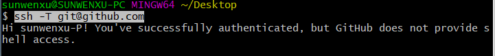

#### Git

我觉得我这个脑子还是有必要把这个学习记录下的。

##### 安装

就略过。这是个最简单不过的事情了[Git官网](http://git-scm.com/downloads)

##### 使用

因为我使用的是win系统，所以我记录下我自己操作的流程。

随便哪个盘，新建文件夹（避免使用中文），然后右键会看到

``Git Bash Here``  命令行窗口执行``git init`` ，目前我们已经初始化了一个仓库。

我们进入文件夹下会看到一个``.git`` 目录，接下来我们就可以添加文件试下了，创建个readme.txt先测试下，千万别用win自带的记事本来创建，这是个坑。

我们将创建的文件放到我们的目录下，命令行窗口下运行：

``git add filename`` filename就是你文件的名字，或者：

``git add .``  "."点这个意思就是全部由变动的文件。

执行上面的命令就是告诉git将我们的文件添加到仓库，接下来执行命令将文件提交到仓库:

``git commit -m "说明" `` 

引号中的内容可以添加我们此次提交文件的说明，然后 窗口会有此次文件的变动信息。

##### 使用远程仓库

先检查我们本地是否有ssh密钥

``ls -al ~/.ssh`` 

如果没有的话，生成密钥：

``ssh-keygen -t ed25519 -C "your_email@example.com``

这里需要替换成自己的github邮箱。一路回车，密钥会保存在：

``C:\Users\admin\.ssh`` 

至少我的是，如果你的用户名也和我一样是admin的话。

接下来添加github上。点自己大头--Settings--SSH and GPG keys--New SSH key ,将本的id_rsa.pub文件记事本打开，复制密钥保存到GitHub上就完成了。

接下里测试下连接是否正常：

``ssh -T git@github.com`` 

  完美！

如果出现弹框输入自己的账号和密码验证一次就行。

我们可以用以下语法将我们提交到本地仓库的文件推送到GitHub远程仓库上。

``git push origin master``  

我遇到的是openssl超时错误，先检查下自己电脑有没有开代理可以先将代理关闭。如果不行，我们可以试下在本地仓库中``.git`` 文件夹下有个config文件，打开将url那个https改为http，再试一次。

目前使用到的只有这些，其他的功能使用到再做记录补充。

