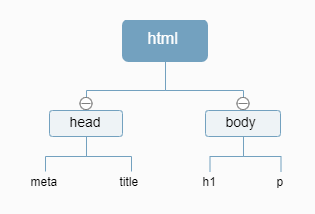

#### 浏览器工作原理

从输入一个网址到看到我们所看到的页面；这背后浏览器做了些什么？

##### 浏览器工作原理

* **DNS解析** 

  当在网址输入一个url点击回车时，它需要将我们的域名解析成ip。

  它会先检索浏览器本身是否存在DNS缓存，如果存在，解析完成；如果不存在，则继续向上查找。例如谷歌我们可以在网址框输入``chrome://net-internals/#dns`` 查看我们浏览器缓存的DNS记录。

  当浏览器中没有DNS缓存，它会查找我们系统中是否存在DNS缓存，如果存在，解析完成；如果不存在，继续向上查找。我们可以在cmd命令行工具下输入``ipconfig /displaydns `` 查看本机的DNS记录。

  系统中没有DNS缓存，则继续向上，接下来会查找本地的DNS服务器，如果域名存在，解析完成；否则，继续向上查找。这里的本地服务器着实没理解了，所以善用搜索引擎，找到了下面一段话：

  >在通过浏览器缓存及host文件都无法解析域名的情况下，OS会将这个域名发送给计算机网络配置中DNS对应的地址（LDNS），即本地区的域名服务器。这个DNS通常都提供给你本地互联网接入的一个DNS解析服务，假如是在学校接入的互联网，那么这个本地区的域名服务器基本上是在学校中；如果是在小区接入的互联网，那么这个本地区的域名服务器就是提供给你接入互联网的应用服务上，也就是电信或联通。
  >--《深入分析java web 技术内幕》 许令波著

  再往上就是权威DNS服务器（server.com）、顶级域DNS服务器，最后就是根DNS服务器。反正最后的结果就是会找到的。

  到这里DNS解析完成，我们输入的一个域名（例如百度www.baidu.com）已经被定为ip地址为``202.108.22.5`` 的服务器了。

* **TCP连接** 

  tcp：传输控制协议，是传输层的通讯协议，是一种面向连接的、可靠的、基于字节流的传输层通信协议

  听的最多的就是三次握手连接，四次挥手断开，实际还是一知半解，这里就学习作下记录。

  三次握手过程：

  1.客户端向服务器发送SYN包，包中会携带一个随机序列数。

  2.服务端收到合法的SYN包后，回送一个SYN/ACK

  3.客户端收到SYN/ACK以后，发送一个ACK包

  
  
* **TLS协商** 

  在https上建立安全的连接，通常会进行TLS协商，决定如果加密数据，如何验证服务器，经过几次的往返，浏览器终于可以向服务器发出请求了。

* **数据请求** 

  到这里浏览器才和服务器开始通讯，浏览器发送http请求。http请求必要携带**请求行** 、**请求头** 、**请求体** 。

  ``GET / HTTP/1.1 #请求的方法为GET 根路径 HTTP协议为1.1  ``  

  下面是HTTp请求的请求头

  ```
  GET /home.html HTTP/1.1
  Host: developer.mozilla.org
  User-Agent: Mozilla/5.0 (Macintosh; Intel Mac OS X 10.9; rv:50.0) Gecko/20100101 Firefox/50.0
  Accept: text/html,application/xhtml+xml,application/xml;q=0.9,*/*;q=0.8
  Accept-Language: en-US,en;q=0.5
  Accept-Encoding: gzip, deflate, br
  Referer: https://developer.mozilla.org/testpage.html
  Connection: keep-alive
  Upgrade-Insecure-Requests: 1
  If-Modified-Since: Mon, 18 Jul 2016 02:36:04 GMT
  If-None-Match: "c561c68d0ba92bbeb8b0fff2a9199f722e3a621a"
  Cache-Control: max-age=0
  ```

  请求体的话一般只会出现在``POST`` 请求中

* **响应** 

  与请求头对应的响应头也是三部分：**响应行** 、**响应头** 、**响应体** 

  下面是一个响应头

  ```
  200 OK
  Access-Control-Allow-Origin: *
  Connection: Keep-Alive
  Content-Encoding: gzip
  Content-Type: text/html; charset=utf-8
  Date: Mon, 18 Jul 2016 16:06:00 GMT
  Etag: "c561c68d0ba92bbeb8b0f612a9199f722e3a621a"
  Keep-Alive: timeout=5, max=997
  Last-Modified: Mon, 18 Jul 2016 02:36:04 GMT
  Server: Apache
  Set-Cookie: mykey=myvalue; expires=Mon, 17-Jul-2017 16:06:00 GMT; Max-Age=31449600; Path=/; secure
  Transfer-Encoding: chunked
  Vary: Cookie, Accept-Encoding
  X-Backend-Server: developer2.webapp.scl3.mozilla.com
  X-Cache-Info: not cacheable; meta data too large
  X-kuma-revision: 1085259
  x-frame-options: DENY
  ```

  这样我们就完成了请求的数据，如果请求头或者响应头中有``Connection:Keep-Alive`` ,TCP会一直保持连接。

* ##### 解析

  响应头中``Content-Type`` 是响应类型，值为``text/html`` ,浏览器就开始解析。

  * 构建DOM树

    ```<html lang="en">
    <html lang="en">
    <head>
        <meta charset="UTF-8">
        <title>Document</title>
    </head>
    <body>
        <h1>title</h1>
        <p>text</p>
    </body>
    </html>
    ```

    上面一段代码会为我们构建出来DOM树：

    

    其中这里还有好多深入的细节的东西，按照我现在水平可能无法理解透彻。这里的[网站](https://www.html5rocks.com/zh/tutorials/internals/howbrowserswork/#Introduction)很详细的介绍其构建DOM树时做了什么。

  * 构建CSSOM树

    与创建DOM相似，与DOM树是两棵树。

  * Javascript编译

* ##### 渲染

  DOM和CSSOM组合形成render树，渲染树从DOM根节点开始遍历可见的节点。之后开始计算每个节点的位置，宽度，高度。将各个节点绘制到屏幕上。

这个感觉是个无限难的基础，水平有限只能理解到这个程度，希望回头复习时能有更深一步的理解吧！